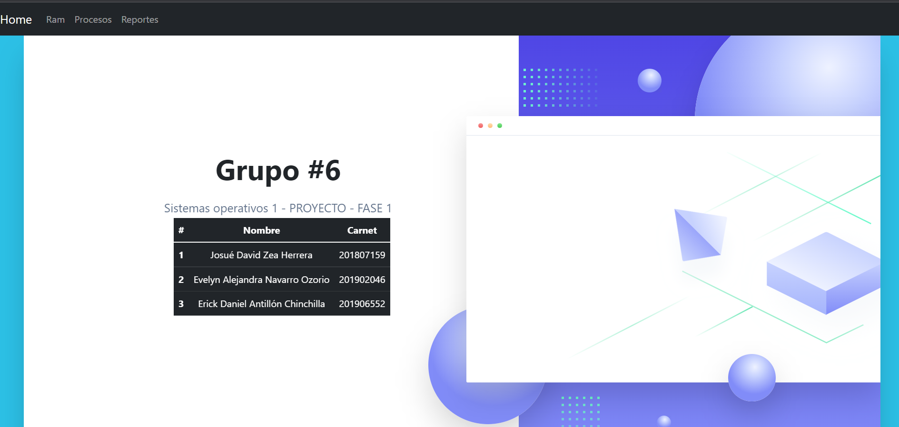
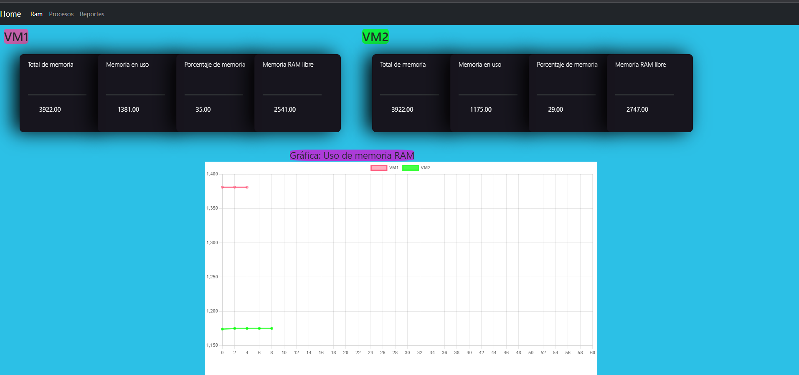
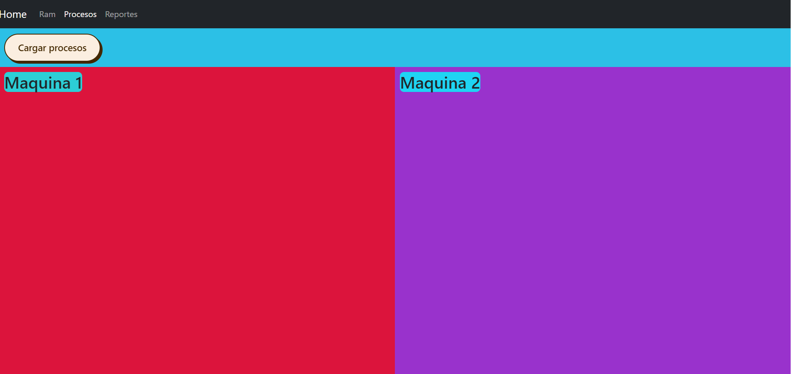
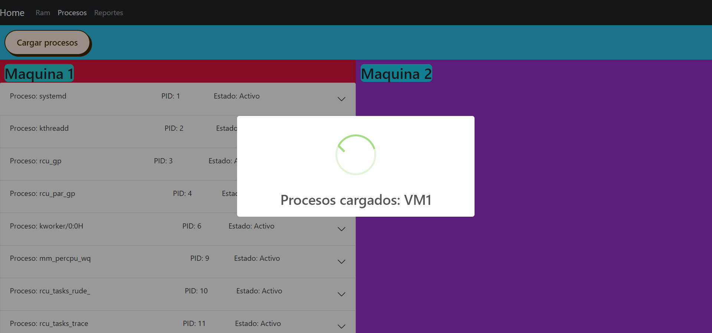
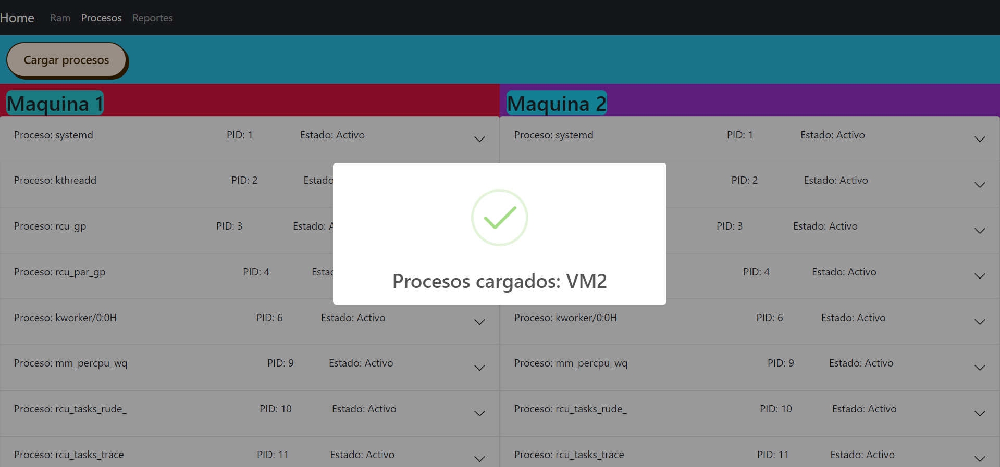
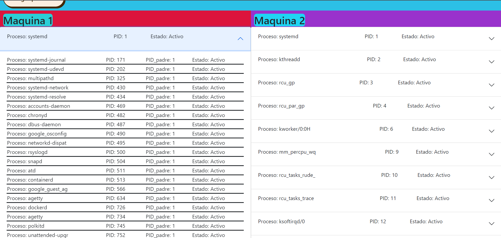
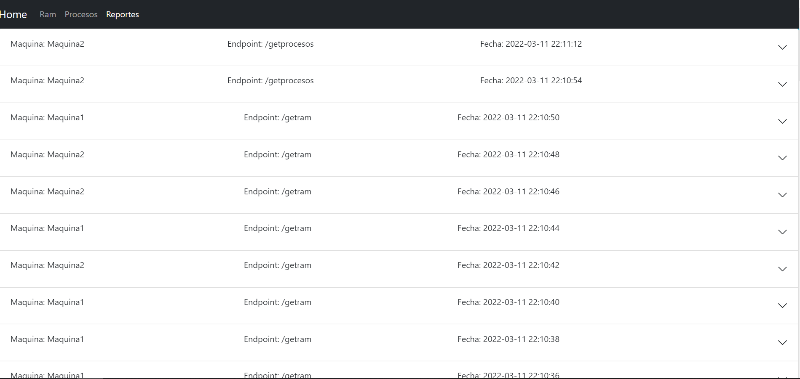
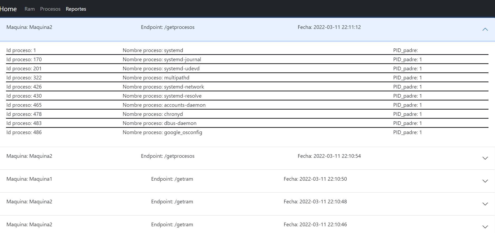
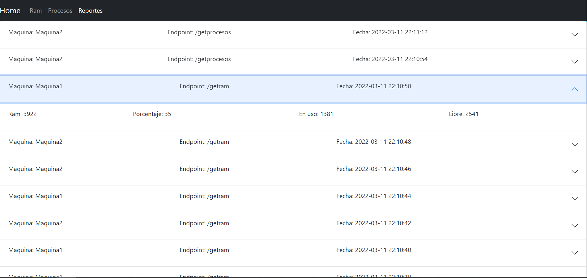

# Manual de Usuario

_Proyecto Fase 1 - Sistemas Operativos 1_

### Grupo #6🚀

_La fase 1 del proyecto nos permite conocer la información de la memoria ram y los procesos de dos máquinas virtuales alojadas en los servicios Virtual Machine de google cloud platform, esto mediante el uso de modulos kernel implementados en las máquinas, la información recolectada se almacena en una base de datos en la nube para poder obtener sus registros posteriormente._

# 📋 Detalle de cada Seccion

### Pagina principal
 
### Visualizacion de memoria RAM

_Aquí podemos visualizar el comportamiento de la memoria ram en cada una de las maquinas virtuales en tiempo real, en la parte superior se encuentra dateallada la información actual de cada una y en la gráfica podemos observar como ha sido el comportamiento de la memoria de manera gráfica._
#### Visualizacion de los procesos

_En esta pesaña observaremos la lista de procesos en ejecución por cada maquina virtual._
#### Carga de procesos

_Presionando el boton "Cargar procesos" podemos cargar la información de una de las dos máquinas virtuales (esto depende de la información devuelta por el balanceador de carga)._
#### Visualización de subprocesos

#### Visualizacion API Reports

_Una vez se ingrese a esta pestaña se cargará la información mediante el uso de sockets y posteriormente podrá ser visualizada._

